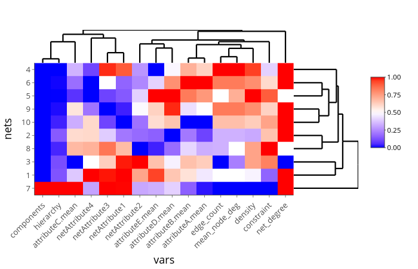

<!-- README.md is generated from README.Rmd. Please edit that file -->

```{r, echo = FALSE}
knitr::opts_chunk$set(
  collapse = TRUE,
  eval = FALSE,
  comment = "#>",
  fig.path = "README-"
)
```

# neatmaps

[](https://CRAN.R-project.org/package=neatmaps) [](https://CRAN.R-project.org/package=neatmaps)

### Overview

The goal of the `neatmaps` package is to simplify the exploratory data analysis
process for multiple network data sets with the help of heatmaps and consensus
clustering. Multiple network data consists of multiple disjoint networks that
share common variables. Ego networks are an example of such data sets.
This package contains tools necessary to prepare raw multiple network data
for analysis, create a heatmap of the data, perform consensus clustering on the
networks' variables and assess the stability of associations among variables
depicted in the heatmap.

### Installation

``` {r}
# To install neatmaps, simply run the following code:
install.packages('neatmaps')
```

### Code Example

Below is an example of how to use the key functions in the `neatmaps` package
on a simulated network dataset. Run this code locally to produce the plots.

First, load the package and format the network data using the `netsDataFrame`
function. This function has four inputs: an $n x p$ data frame of
$n$ networks described by $p$ graph attributes (e.g. density), an
$n x mk$ data frame of $n$ networks, their $m$ nodes and $k$ variables
describing these nodes (e.g. age of node, in a social network context),
a data frame containing the undirected adjacensy matrix and a string defining
the aggregation function used to summarize the node variable data.

The data frame is then passed to the `neatmap` function. The data is scaled
using the `ecdf` method, and the maximum number of clusters among the aggregated
variables to be considered by consensus clusterting is set to five. For each
iteration of consensus clustering, 1000 bootstrap repititons are computed.

```{r run-neatmap}
library(neatmaps)

set.seed(215)

df <- netsDataFrame(network_attr_df,
                    node_attr_df,
                    edge_df)

neat_res <- neatmap(df, scale_df = "ecdf", max_k = 5, reps = 1000, 
                    xlab = "vars", ylab = "nets", xlab_cex = 1, ylab_cex = 1)
```

Next, the heatmap is plotted.
```{r plot-heatmap}
neat_res$heatmap
```

```{r heatmap, eval=TRUE, echo=FALSE}
# heatmap of network data saved as toy_hm.png in inst/ folder

```

Finally, the results of the consensus clustering are visualized to identify the
stable clusters of variables in the heatmap. The consensus matrices are
presented first, followed by the ECDFs of the consensus matrices and finally
the relative change in ECDF of consecutive iterations of the consensus
clustering algorithm.

```{r consensus-matrices}
consensusMap(neat_res)
```

```{r plot_consensus_mats_1, out.width='50%', eval=TRUE, echo=FALSE}
# consensusMap results saved as cons_hm_2.png and cons_hm_3.png in inst/ folder
knitr::include_graphics(c("inst/cons_hm_2.png", "inst/cons_hm_3.png"))
```
```{r plot_consensus_mats_2, out.width='50%', eval=TRUE, echo=FALSE}
# consensusMap results saved as cons_hm_4.png and cons_hm_5.png in inst/ folder
knitr::include_graphics(c("inst/cons_hm_4.png", "inst/cons_hm_5.png"))
```

```{r ECDFs}
consensusECDF(neat_res)
```

```{r relative-change-ECDFs}
consensusChangeECDF(neat_res)
```

```{r plot_ecdf, out.width='50%', eval=TRUE, echo=FALSE}
# consensusECDF results saved as ecdf.png in inst/ folder
# consensusChangeECDF results saved as rel_ecdf.png in inst/ folder
knitr::include_graphics(c("inst/ecdf.png", "inst/rel_ecdf.png"))
```

These results indicate that there are likely four distinct clusters among the
aggregated network variables, since the consensus matrix with four clusters
offers the shapest contrasts between clusters, it's ECDF most closely resembles
that of an indicator function, and because of the elbow in the relative change
of the ECDF occurs when there are four clusters.

Further documentation is available on [CRAN](https://CRAN.R-project.org/package=neatmaps/neatmaps.pdf).
