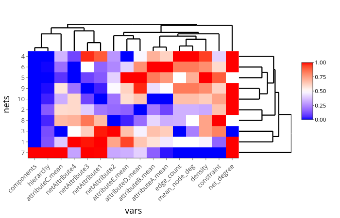
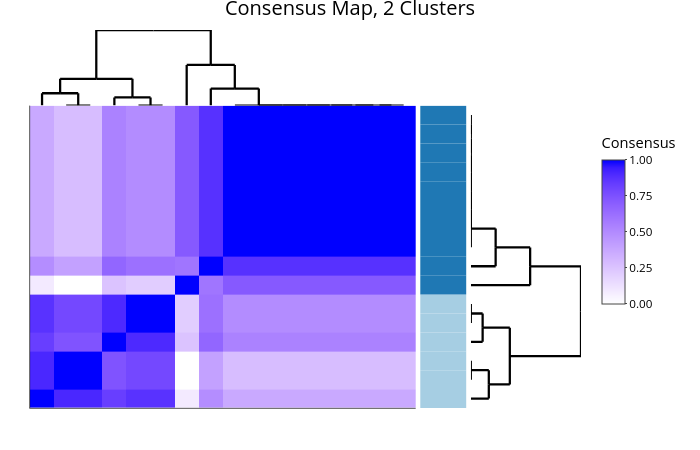
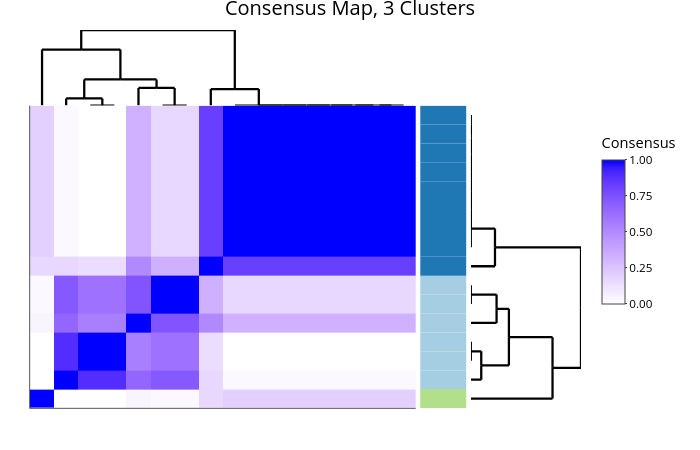
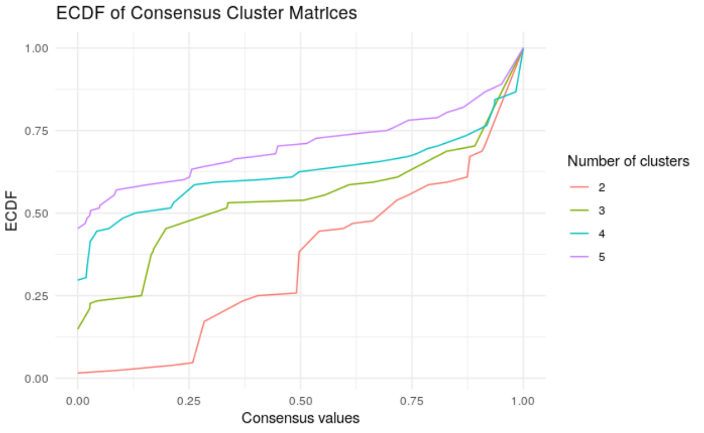
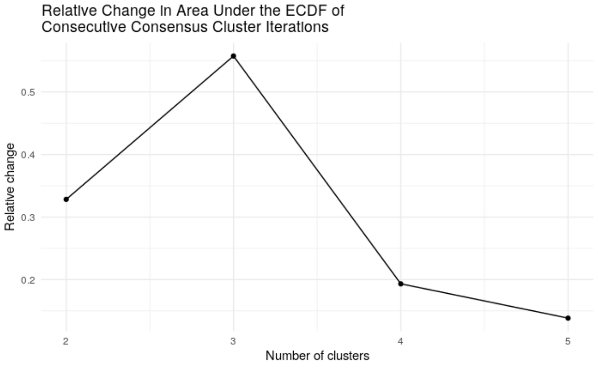

<!-- README.md is generated from README.Rmd. Please edit that file -->
neatmaps
========

[](https://CRAN.R-project.org/package=neatmaps) [](https://CRAN.R-project.org/package=neatmaps)

### Overview

The goal of the neatmaps package is to simplify the exploratory data analysis process for multiple network data sets with the help of heatmaps and consensus clustering. Multiple network data consists of multiple disjoint networks that share common variables. Ego network data sets are an example of such data sets. This package contains the necessary tools to prepare raw multiple network data for analysis, create a heatmap of the data, perform consensus clustering on the networks' variables and assess the stability of the variable clusters depicted in the heatmap.

### Installation

``` r
# To install neatmaps, simply run the following code:
install.packages('neatmaps')
```

### Code Example

Below is an example of how to use the key functions in the `neatmaps` package. Run this code locally to produce the plots.

First, load the package, create a data frame with the data provided in the package and then run the `neatmap` function.

``` r
library(neatmaps)

df <- netsDataFrame(network_attr_df,
                    node_attr_df,
                    edge_df)

neat_res <- neatmap(df, scale_df = "ecdf", max_k = 3, reps = 100, 
                    xlab = "vars", ylab = "nets", xlab_cex = 1, ylab_cex = 1)
```

Next, plot the heatmap stored in `neat_res`.

``` r
neat_res$heatmap
```



Finally, the results of the consensus clustering are visualized to identify the stable clusters of variables in the heatmap. The consensus matrices are presented first, followed by the ECDFs of the consensus matrices and finally the relative change in ECDF of consecutive iterations of the consensus clustering algorithm.

``` r
consensusMap(neat_res)
```





``` r
consensusECDF(neat_res)
```



``` r
consensusChangeECDF(neat_res)
```



### Documentation

Available on [CRAN](https://CRAN.R-project.org/package=neatmaps/neatmaps.pdf).
